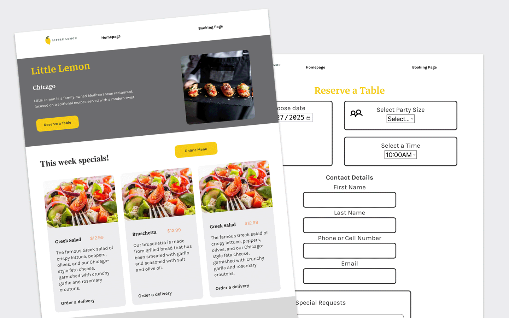

## Table of Content

- [Introduction](#introduction)
- [Software and Languages Used](#software-and-languages-used)
- [Planning Stages](#planning-stages)
    - [User Persona](#user-persona)
    - [Wireframe](#wireframe)
    - [UI Design](#ui-design)
- [Final Site Build](#final-site-build)
- [Live Demo](#live-demo)
- [Screenshots](#screenshots)
- [Installation](#installation)
- [License](#license)

# Introduction

I designed a react app that showcased a solution for creating a restaurant reservation system on the Little Lemon Restaurant web site. The project was my final capstone site for the Coursera Front End Developer Certificate program. The site encompassed many of the front-end techonologies and principles we learned in the class to date.

## Software and Languages Used

Figma, Adobe Photoshop, Visual Studio Code, Github
HTML5, CSS and ReactJS

## Planning Stages

I recieved an objective in class to create a new online reservation system for The Little Lemon Website. Coursera provided us with a figma file that we had to build off of that included a style guide with predetermined fonts, colors and sizing for the site.

The initial stages of the UI process involves brainstorming and creating a user persona. We were taught in the course the philosophies and best practices of usability.

Firstly, I sketched my ideas on paper in a rough manner. Then I proceeeded to create a grayscale wireframe in Figma that was as close to the original design as possible in terms of overal layout.

The final stage after the grayscale wireframe included adding all the photos, colors and some interactivity to the prototype.

---

### User Persona

Show User Persona

 

### Wireframe

Show Wireframe

 

### Prototype

Show Prototype

---

## Final Site Build

Show Final Site Info

---

## Live Demo

[Live Demo Link](https://jgcodingmain.github.io/capstone-project/#/homepage)

---

### `npm run build` fails to minify

This section has moved here: [https://facebook.github.io/create-react-app/docs/troubleshooting#npm-run-build-fails-to-minify](https://facebook.github.io/create-react-app/docs/troubleshooting#npm-run-build-fails-to-minify)
